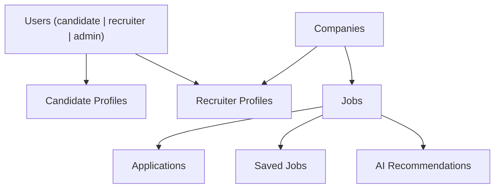

# Database Execution Strategy & Architecture Snapshot

This document serves as the design snapshot and development roadmap for the HireFlow database layer.

---

## 1. Database Architecture Philosophy

### Core Principles

- **Workflow-Oriented Schema Design**: The schema directly models actual recruiter and candidate hiring workflows rather than generic CRUD tables.
- **Query-Driven Design**: Table structures are intentionally optimized based on target UI query patterns, dashboard rendering requirements, and search/analytics specifications.
- **Future Auth Compatibility**: Though auth is postponed, schema patterns are architected with built-in support for resource ownership, role permissions, RBAC structures, and company organization scoping.

---

## 2. High-Level Database Architecture

---

## 3. Technology Stack

| Concern | Technology |
|---|---|
| Database | Supabase PostgreSQL |
| ORM | Prisma |
| Migrations | Prisma Migrate |
| File Storage | Supabase Storage |
| Auth Integration | Supabase Auth (Future Phase) |
| Search | PostgreSQL FTS + Trigram |
| Analytics persistence | Aggregated analytics tables |

---

## 4. Multi-Phase Relational Schema Roadmap

### Phase 1 — Foundation & Core Schema
- **Stage 1**: Prisma initialization, Supabase integration config, snake_case database naming conventions.
- **Stage 2**: Core entity modeling separating `users` from `candidate_profiles` and `recruiter_profiles` to support RBAC extensibility.
- **Stage 3**: Job system schema, slug generation support, and composite index placements for common queries.
- **Stage 4**: Structured profile fields for candidates and recruiters (avoiding JSON blob overloads).
- **Stage 5**: Realist development seed data orchestration.

### Phase 2 — Workflow & Application Systems
- **Stage 1**: Applications system tracking lifecycle stages (`applied`, `reviewing`, `shortlisted`, `interview`, `rejected`, `hired`).
- **Stage 2**: Saved jobs system with duplicate prevention and candidate mapping indexation.
- **Stage 3**: Workflow audit event tracking to reconstruct recruiter/candidate action timelines.
- **Stage 4**: Notifications schema supporting read/unread indicators.
- **Stage 5**: Query optimization pass eliminating N+1 retrieval anomalies.

### Phase 3 — Search & Analytics Infrastructure
- **Stage 1**: PostgreSQL search integration via `tsvector`, trigram matching, and GIN indices.
- **Stage 2**: Composite indexes for multi-faceted filters (salary, location, experience).
- **Stage 3**: Persistent dashboard aggregations (`job_analytics`, `company_analytics`, `candidate_activity`).
- **Stage 4**: Persisted candidate recommendation tables storing matching scoring data.
- **Stage 5**: Search performance optimization checks.

### Phase 4 — Auth & Security Architecture
- **Stage 1**: Supabase auth integration planning mapping roles (`candidate`, `recruiter`, `admin`).
- **Stage 2**: Row-Level Security (RLS) policies enforcing candidate/company isolation.
- **Stage 3**: Private storage rule definition utilizing signed URLs.
- **Stage 4**: Security compliance audit logging table integrations.
- **Stage 5**: RLS performance validation.

### Phase 5 — Production Hardening & Scalability
- **Stage 1**: Backup & recovery plans.
- **Stage 2**: Query performance audits resolving index misses and slow joins.
- **Stage 3**: Connection pool optimization.
- **Stage 4**: Referential transaction checks.
- **Stage 5**: Load test verification.
